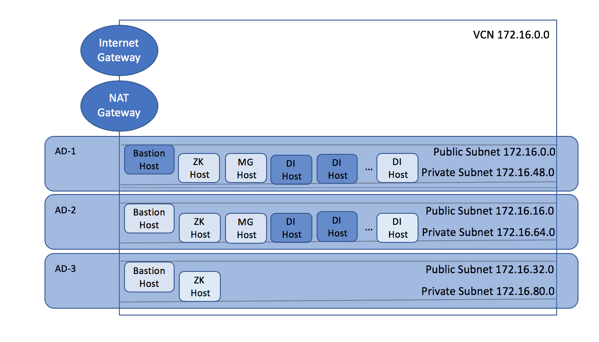

###### Copyright (c) 1999, 2019, Oracle and/or its affiliates. All rights reserved.
###### Licensed under the Universal Permissive License v 1.0 as shown at <http://oss.oracle.com/licenses/upl>
###### Version v3_180205_18.1.2.0.0
    #     ___  ____     _    ____ _     _____
    #    / _ \|  _ \   / \  / ___| |   | ____|
    #   | | | | |_) | / _ \| |   | |   |  _|
    #   | |_| |  _ < / ___ | |___| |___| |___
    #    \___/|_| \_/_/   \_\____|_____|_____|
***
This example uses Terraform to allocate OCI resources for running the Oracle TimesTen Scaleout [InMemory] Database.
Ansible scripts are provided to rollout a database across the provisioned infrastructure.
This is a bring-your-own-license (BYOL) solution for Oracle TimesTen Scaleout.
Please see the whitepaper, [Deploying Oracle TimesTen Scaleout Database on OCI](https://www.oracle.com/technetwork/database/database-technologies/timesten/overview/wp-deployingtimestenscaleoutonoci-5069015.pdf "whitepaper")

The example creates a VCN with one or more public subnets running bastion hosts.
Private subnets are created to run the hosts needed for TimesTen Scaleout.

***
Deployment diagram.  The dark boxes indicate the default configuration created by the Terraform and Ansible scripts.

***

This distribution provides an utility, _provisionScaleoutOCI_, that automates many provisioning tasks discussed in this README and the associated whitepaper.  If you already have a compute instance provisioned in the OCI cloud, please see the [QUICKSTART.md](./QUICKSTART.md) file.

***

### Using this example
* Copy TimesTen Scaleout [and optional JDK/JRE 8 distribution](https://docs.oracle.com/javase/8/docs/technotes/guides/install/install_overview.html#A1097144 "JRE/JDK 8") .zip or .tar.gz files to the service/packages directory.
* Update env-vars with the required information.
This example uses the same set of environment variables as other terraform examples, so you only need to do this once.
* Source env-vars
* `$ . ./env-vars`
* Update variables in variables.tf as applicable to your target environment.
* terraform plan
* terraform apply [--auto-approve]

To destroy all the resources created
* terraform destroy -force

The route table used for the private subnets is configured to use a NAT gateway as the default route target.
Bastion host instances are configured as NAT instances, by enabling forwarding and configuring firewall to do forwarding/masquerading, but routing occurs through the NAT gateway, not through the private IP addresses of the Bastion hosts.
See [Using a Private IP as a Route Target](https://docs.us-phoenix-1.oraclecloud.com/Content/Network/Tasks/managingroutetables.htm#privateip) for more details if you wish to use the private IP routing feature.

Once the environment is built, the compute instances on the private network have Internet connectivity.
A private instance doesn't have a public IP address and it's subnet's route table doesn't contain Internet gateway.  
You can login into the private instance via ssh from the Bastion host.
To verify connectivity, you can then run a command like 'ping oracle.com'

### Files in the configuration

#### `env-vars`
Is used to export the environmental variables used in the configuration.
These variables include references to private key file information for access to the OCI infrastructure.

Before you plan, apply, or destroy the configuration source the file -  
`$ . env-vars`

#### `variables.tf`
Defines variables for TimesTen Scaleout configuration.
Modify this to change the default TimesTen Scaleout 2x2 configuration created.

### `public.tf`
Creates the VCN, the public subnets, and the compute instances used as bastion hosts.

### `private.tf`
Creates the private subnets, and the compute instances used as zookeeper servers, management instances, or database instances.

### `system-config.tf`
Contains terraform resources for initial configuration of the compute instances.
Installs ansible on 1 bastion host.
Variables and configuration files for ansible are set up as well.

### `service` directory
* ansible  - Ansible playbooks and task yaml.
* packages - Required BYOL software: Timesten Scaleout distribution, JDK
* scripts  - Miscellaneous configuration scripts

###
Using Ansible to set up hosts and rollout TimesTen Scaleout
* `$ ssh opc@<bastion-host address> e.g. 129.146.2.3`
* `$ cd service/ansible`
* `$ ansible-playbook -i hosts rollout.yaml`

Always run ansible on the bastion host.

To scale out the number of data instances
* Modify variables.tf to set diInstanceCount=<bigger than before>
* terraform plan
* terraform apply --auto-approve  
  Then ssh to the bastion host,  
* `$ cd service/ansible`
* `$ ansible-playbook -i hosts scaleout.yaml`

To stop the zookeeper servers, management instances and database,
* `$ ansible-playbook -i hosts stop.yaml`  
  Note that this does not stop any cloud resources provisioned and charging continues.

To restart all the servers after running stop.yaml,
* `$ ansible-playbook -i hosts restart.yaml`

To destroy the database, removing the data and mgmt instance directories
* `$ cd service/ansible`
* `$ ansible-playbook -i hosts dbdestroy.yaml`

To recreate the database after dbdestroy.yaml
* Modify service/ansible/roles/mgmtinstances/templates/attributes.dbdef.j2
on the bastion host to make any changes to database attributes.
* `$ ansible-playbook -i hosts datainstances.yaml mgmtinstances.yaml`

To provision clients on their own compute instances
* Modify variables.tf to set clInstanceCount > 0
* `terraform plan`
* `terraform apply --auto-approve`  
Then ssh to the bastion host,  
* `$ cd service/ansible`
* `$ ansible-playbook -i hosts client.yaml`

Client instances are also created on mangement and zookeeper servers 
if they have been offloaded to their own compute instances.

Using DenseIO or HighIO shapes with NVMe storage provides the best write performance.  
To allocate the database on Block Volumes,
* Specify a standard shape for diInstanceShape
* Set diBlockVolumeSizeGB >= 50  
  Minimum allocation is 50 GB.

By default, compute instances in a TT Scaleout configuration with K==2 span availability domains AD-1 and AD-2 (Variable initialAD==1).
* To use or start allocation in a particular AD, set initialAD={1|2|3}  
For example, if K==2 and initialAD==2, one data space will be located in AD-2, the other in AD-3.  
To use only a single AD  
* Set singleAD == "true" in variables.tf

Bastion hosts are created in AD-1 by default.
* Set bsInstanceInitialAD=={2|3} to place the bastion host in another AD.  
This may be useful for trial or pay as you go accounts.  
For trial or pay-as-you-go accounts set:  
* initialAD=(bsInitialInstanceAD % 3) + 1
* diInstanceShape=VM.Standard2.2
* diBlockVolumeSizeGB=90

